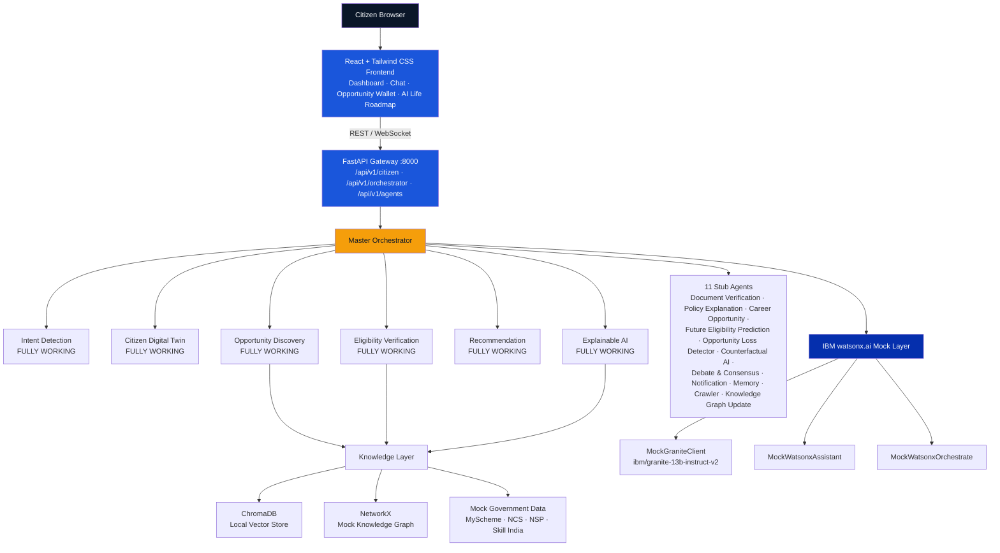

<div align="center">

# 🏛️ IntelliGov AI

### Enterprise Multi-Agent Citizen Service Intelligence Platform

**Helping every Indian citizen discover the government schemes, scholarships, jobs, internships, and healthcare benefits they qualify for — before they miss them.**

[](https://www.python.org/)
[](https://fastapi.tiangolo.com/)
[](https://react.dev/)
[](https://tailwindcss.com/)
[](https://www.ibm.com/watsonx)
[](https://www.trychroma.com/)
[](./LICENSE)
[](./.github/workflows)
[](./CONTRIBUTING.md)
[](#)

</div>

---

## 📖 Table of Contents

- [Project Overview](#-project-overview)
- [Problem Statement](#-problem-statement)
- [Why This Project Exists](#-why-this-project-exists)
- [Objectives](#-objectives)
- [Key Features](#-key-features)
- [Innovation Highlights](#-innovation-highlights)
- [IBM Technology Mapping](#-ibm-technology-mapping)
- [Architecture Overview](#-architecture-overview)
- [High-Level Workflow](#-high-level-workflow)
- [System Architecture Diagram](#-system-architecture-diagram)
- [Agent Architecture](#-agent-architecture)
- [Folder Structure](#-folder-structure)
- [Tech Stack](#-tech-stack)
- [Installation Guide](#-installation-guide)
  - [Backend Setup](#backend-setup)
  - [Frontend Setup](#frontend-setup)
  - [Environment Variables](#environment-variables)
  - [Running Locally](#running-locally)
- [API Overview](#-api-overview)
- [Future Scope](#-future-scope)
- [Roadmap](#-roadmap)
- [Screenshots](#-screenshots)
- [Demo](#-demo)
- [Team](#-team)
- [Contributing](#-contributing)
- [License](#-license)
- [Acknowledgements](#-acknowledgements)

---

## 🌐 Project Overview

**IntelliGov AI** is an enterprise-grade, multi-agent citizen service intelligence platform designed to close the awareness gap between Indian citizens and the government benefits they are entitled to. Powered by **IBM Granite foundation models via watsonx.ai**, the platform coordinates **18 specialized AI agents** through a **Master Orchestrator**, backed by a **Retrieval-Augmented Generation (RAG) pipeline**, a **Knowledge Graph**, and a **local vector database**, to surface, explain, and track personalized government opportunities for every citizen.

This repository contains the hackathon build for the **IBM SkillsBuild BOB Hackathon**, submitted as a **video demo + slide deck + working GitHub repository**.

> 🧪 **Build Scope:** 7 agents are fully implemented with real orchestration logic and a local RAG/Knowledge Graph pipeline. The remaining 11 agents are documented, wired into the orchestrator, and return realistic, structured stub responses — designed as drop-in extension points for production IBM Cloud services.

---

## ❗ Problem Statement

Millions of eligible Indian citizens never receive government schemes, scholarships, job opportunities, or healthcare benefits — not because they don't qualify, but because:

- Scheme information is fragmented across dozens of portals (MyScheme, NSP, NCS, Skill India).
- Eligibility criteria are written in legal/bureaucratic language that's hard to self-assess against.
- There is no single, personalized, continuously-updating view of "what am I eligible for, right now and in the future."
- Citizens have no way to know what they **missed** or what they'll **become eligible for** as their life circumstances change.

## 💡 Why This Project Exists

IntelliGov AI exists to turn government benefit discovery from a manual, fragmented search into an **intelligent, explainable, proactive experience** — the same way a knowledgeable government caseworker would guide a citizen, but available instantly, at scale, for every citizen in the country.

## 🎯 Objectives

- Build a **Master Orchestrator** that coordinates specialized AI agents to resolve a citizen's query end-to-end.
- Ground every recommendation in **structured eligibility data** and a **traversable Knowledge Graph**, not opaque LLM guesses.
- Demonstrate a clear, credible **production upgrade path** from local mocks to real IBM Cloud / watsonx.ai services.
- Ship a **polished, demo-ready UI** that visualizes multi-agent reasoning in real time.
- Package the entire system as a clean, professional, enterprise-style open-source repository.

---

## ✨ Key Features

| Feature | Description |
|---|---|
| 🧠 **Master Orchestrator** | Coordinates all 18 agents in a defined pipeline, aggregating results into a unified Decision Engine output |
| 🔎 **Intent Detection** | Classifies citizen queries into scheme discovery, scholarship search, job search, eligibility checks, and more |
| 👤 **Citizen Digital Twin** | A persistent AI persona of each citizen that tracks profile, eligibility cache, and opportunity history |
| ✅ **Eligibility Verification** | Computes machine-readable eligibility scores against schemes, scholarships, jobs, and internships |
| 🗂️ **Opportunity Discovery** | RAG-powered retrieval across schemes, scholarships, jobs, internships, and skill programs |
| 📊 **Recommendation Engine** | Ranks opportunities by eligibility, benefit value, deadline urgency, and citizen preference |
| 🧩 **Explainable AI (XAI)** | Walks the Knowledge Graph to explain *why* a citizen is eligible, as a traversable reasoning path |
| 💬 **Conversational Interface** | Chat-based interaction backed by a watsonx Assistant–compatible mock layer |
| 🗺️ **AI Life Roadmap** | Visual timeline of a citizen's government opportunity journey |
| 🎞️ **18-Agent Pipeline Visualizer** | Real-time animated view of every agent as it processes a query |

## 🌟 Innovation Highlights

| Innovation | What It Does | Why It Matters |
|---|---|---|
| ⭐ **Future Eligibility Prediction** | Predicts which schemes a citizen will qualify for in 6–12 months | Proactive, forward-looking guidance instead of reactive search |
| ⭐ **Opportunity Loss Detector** | Alerts citizens to schemes they missed or deadlines that have passed | Surfaces real, emotionally resonant impact |
| ⭐ **Counterfactual AI** | *"If you complete 10th class, you qualify for 3 more schemes"* | Actionable, explainable, uniquely contextual to Indian education/benefit pathways |
| **Debate & Consensus Agent** | Multiple agents debate and reach consensus on the best recommendation | Novel multi-agent reasoning design |
| **Knowledge Graph XAI** | Explanations rendered as a traversable graph path: Citizen → Criteria → Scheme | Enterprise-grade transparency and auditability |

---

## 🏗️ IBM Technology Mapping

| Component | IBM Service (Production) | Current Mock Implementation |
|---|---|---|
| LLM / Foundation Model | watsonx.ai — `ibm/granite-13b-instruct-v2` | `MockGraniteClient` |
| Conversational AI | watsonx Assistant | `MockWatsonxAssistant` |
| Agent Orchestration | watsonx Orchestrate | `MockWatsonxOrchestrate` |
| Vector Database | watsonx.data / Milvus | ChromaDB (local) |
| Knowledge Catalog | IBM Knowledge Catalog | NetworkX (in-memory graph) |
| AI Governance | IBM OpenScale / AI Factsheets | Confidence scores in `AgentResponse` |
| Object Storage | IBM Cloud Object Storage | Local file system |
| API Gateway | IBM API Connect | FastAPI built-in routing |
| Event Streaming | IBM Event Streams | In-memory queue |
| Authentication | IBM App ID | JWT stub |

Every mock component is built to the **exact interface** its real IBM SDK counterpart exposes — see [`docs/deployment-guide.md`](docs/deployment-guide.md) for the full production upgrade path.

---

## 🧭 Architecture Overview

IntelliGov AI is organized into five logical layers:

1. **Input Layer** — React + Tailwind frontend (Citizen Dashboard, Chat Interface, Opportunity Wallet, AI Life Roadmap)
2. **Gateway Layer** — FastAPI Gateway exposing `/api/v1/citizen`, `/api/v1/orchestrator`, and `/api/v1/agents`
3. **Multi-Agent Layer** — Master Orchestrator coordinating 7 fully working agents and 11 stub agents
4. **Knowledge Layer** — ChromaDB vector store, NetworkX Knowledge Graph, and mock government datasets
5. **IBM Mock Layer** — `MockGraniteClient` and related mocks, designed as drop-in replacements for real `ibm-watsonx-ai` SDK calls

## 🔄 High-Level Workflow

1. Citizen submits a query via the Chat Interface or Dashboard.
2. FastAPI Gateway routes the request to the Master Orchestrator.
3. **Intent Detection Agent** classifies the query and extracts entities.
4. **Citizen Digital Twin Agent** builds or retrieves the citizen's profile snapshot.
5. **Opportunity Discovery Agent** runs a RAG query across the Knowledge Layer.
6. **Eligibility Verification Agent** scores each discovered opportunity against the citizen's profile.
7. **Recommendation Agent** ranks the top opportunities.
8. **Explainable AI Agent** generates a Knowledge-Graph-backed explanation for each recommendation.
9. Remaining 11 stub agents execute and return structured placeholder contributions.
10. The Master Orchestrator aggregates everything into a `DecisionEngineOutput`, streamed back to the frontend and visualized live via the Agent Pipeline Visualizer.

## 📐 System Architecture Diagram



## 🤖 Agent Architecture

| # | Agent | Status | Purpose |
|---|---|---|---|
| 1 | Master Orchestrator | ✅ Fully Working | Coordinates all 18 agents and aggregates the final decision |
| 2 | Intent Detection | ✅ Fully Working | Classifies citizen query intent and extracts entities |
| 3 | Citizen Digital Twin | ✅ Fully Working | Builds/updates a persistent citizen profile persona |
| 4 | Eligibility Verification | ✅ Fully Working | Scores citizen eligibility against opportunity criteria |
| 5 | Opportunity Discovery | ✅ Fully Working | RAG-based retrieval of matching opportunities |
| 6 | Recommendation | ✅ Fully Working | Ranks and scores opportunities for the citizen |
| 7 | Explainable AI | ✅ Fully Working | Generates Knowledge-Graph-backed explanations |
| 8 | Document Verification | 🧪 Stub | Validates uploaded citizen documents |
| 9 | Policy Explanation | 🧪 Stub | Explains scheme policy text in plain language |
| 10 | Career Opportunity | 🧪 Stub | Surfaces career-path-specific opportunities |
| 11 | Future Eligibility Prediction ⭐ | 🧪 Stub | Predicts eligibility 6–12 months ahead |
| 12 | Opportunity Loss Detector ⭐ | 🧪 Stub | Flags missed schemes and passed deadlines |
| 13 | Counterfactual AI ⭐ | 🧪 Stub | Models "what-if" eligibility scenarios |
| 14 | Debate & Consensus | 🧪 Stub | Multi-agent debate to resolve recommendation conflicts |
| 15 | Notification | 🧪 Stub | Manages citizen alerts and reminders |
| 16 | Memory | 🧪 Stub | Long-term memory store across citizen sessions |
| 17 | Crawler | 🧪 Stub | Simulates ingestion of new government data sources |
| 18 | Knowledge Graph Update | 🧪 Stub | Simulates incremental Knowledge Graph updates |

Full specifications (Purpose, Inputs, Outputs, Prompt, Memory, Tools, Reasoning, Failure Cases, Guardrails, Metrics) for every agent live in [`docs/agent-workflow.md`](docs/agent-workflow.md).

---

## 📁 Folder Structure

```
intelligov-ai/
├── README.md
├── LICENSE
├── CONTRIBUTING.md
├── CODE_OF_CONDUCT.md
├── SECURITY.md
├── .gitignore
├── .env.example
├── docker-compose.yml
├── demo-script.md
├── slide-deck-outline.md
│
├── .github/
│   └── workflows/
│       ├── python-ci.yml
│       ├── react-build.yml
│       ├── lint.yml
│       └── test.yml
│
├── architecture/
│   ├── high-level-architecture.md
│   ├── agent-workflow.md
│   ├── data-flow.md
│   ├── api-flow.md
│   └── diagrams/
│       ├── system-architecture.png
│       └── agent-sequence.md
│
├── docs/
│   ├── architecture-overview.md
│   ├── data-flow.md
│   ├── agent-workflow.md
│   ├── api-flow.md
│   ├── deployment-guide.md
│   ├── development-guide.md
│   └── future-roadmap.md
│
├── backend/
│   ├── main.py
│   ├── requirements.txt
│   ├── Dockerfile
│   ├── .env.example
│   ├── config/
│   │   ├── settings.py
│   │   └── constants.py
│   ├── core/
│   │   ├── orchestrator.py
│   │   ├── agent_registry.py
│   │   └── agent_base.py
│   ├── agents/
│   │   ├── intent_detection/
│   │   ├── citizen_digital_twin/
│   │   ├── eligibility_verification/
│   │   ├── opportunity_discovery/
│   │   ├── recommendation/
│   │   ├── explainable_ai/
│   │   ├── document_verification/
│   │   ├── policy_explanation/
│   │   ├── career_opportunity/
│   │   ├── future_eligibility_prediction/
│   │   ├── opportunity_loss_detector/
│   │   ├── counterfactual_ai/
│   │   ├── debate_consensus/
│   │   ├── notification/
│   │   ├── memory/
│   │   ├── crawler/
│   │   └── knowledge_graph_update/
│   ├── ibm_services/
│   │   ├── watsonx_client.py
│   │   ├── watsonx_assistant.py
│   │   └── watsonx_orchestrate.py
│   ├── knowledge/
│   │   ├── vector_store.py
│   │   ├── knowledge_graph.py
│   │   ├── rag_pipeline.py
│   │   ├── data_loader.py
│   │   └── data/
│   │       ├── schemes.json
│   │       ├── scholarships.json
│   │       ├── jobs.json
│   │       ├── internships.json
│   │       └── skill_programs.json
│   ├── api/
│   │   ├── v1/
│   │   │   ├── router.py
│   │   │   ├── citizen.py
│   │   │   ├── orchestrator.py
│   │   │   ├── agents.py
│   │   │   └── health.py
│   │   └── middleware/
│   │       ├── auth.py
│   │       ├── cors.py
│   │       └── logging.py
│   ├── models/
│   │   ├── citizen.py
│   │   ├── opportunity.py
│   │   ├── agent_request.py
│   │   ├── agent_response.py
│   │   └── decision_engine.py
│   └── tests/
│       ├── test_orchestrator.py
│       ├── test_intent_agent.py
│       ├── test_eligibility_agent.py
│       ├── test_rag_pipeline.py
│       └── test_watsonx_mock.py
│
└── frontend/
    ├── package.json
    ├── tailwind.config.js
    ├── vite.config.js
    ├── Dockerfile
    ├── index.html
    └── src/
        ├── main.jsx
        ├── App.jsx
        ├── components/
        │   ├── layout/
        │   ├── dashboard/
        │   ├── chat/
        │   ├── agents/
        │   └── shared/
        ├── pages/
        ├── services/
        └── store/
```

---

## 🛠️ Tech Stack

| Layer | Technology |
|---|---|
| Frontend Framework | React.js 18 (Vite) |
| Styling | Tailwind CSS |
| State Management | Redux / Zustand |
| Charts | Recharts |
| Animation | Framer Motion |
| Backend Framework | FastAPI (Python) |
| Data Validation | Pydantic |
| Vector Database | ChromaDB (local persistence) |
| Embeddings | `sentence-transformers/all-MiniLM-L6-v2` |
| Knowledge Graph | NetworkX |
| LLM Layer | Mock IBM watsonx.ai Granite client (`ibm/granite-13b-instruct-v2` interface) |
| Testing | Pytest, httpx |
| Containerization | Docker, Docker Compose |
| CI/CD | GitHub Actions |
| License | Apache License 2.0 |

---

## 🚀 Installation Guide

### Prerequisites

- Python 3.11+
- Node.js 18+ and npm
- Git

### Backend Setup

```bash
cd backend
python -m venv venv
source venv/bin/activate        # Windows: venv\Scripts\activate
pip install -r requirements.txt
cp .env.example .env
uvicorn main:app --reload --port 8000
```

Backend will be available at `http://localhost:8000`, with interactive API docs at `http://localhost:8000/docs`.

### Frontend Setup

```bash
cd frontend
npm install
npm run dev
```

Frontend will be available at `http://localhost:5173`.

### Environment Variables

Copy `.env.example` to `.env` in the `backend/` directory and configure as needed. See [`.env.example`](.env.example) for the full list of variables — all IBM credential fields are optional placeholders in the current mock-based build.

### Running Locally

**Option A — Two terminals:**

```bash
# Terminal 1
cd backend && uvicorn main:app --port 8000

# Terminal 2
cd frontend && npm run dev
```

**Option B — Docker Compose:**

```bash
docker-compose up --build
```

This starts the backend on port `8000` and the frontend on port `5173` (or the configured port), with a persistent ChromaDB volume.

---

## 🔌 API Overview

| Method | Endpoint | Description |
|---|---|---|
| `GET` | `/health` | Service health check, includes IBM mock service status |
| `POST` | `/api/v1/citizen/profile` | Create or update a citizen profile |
| `GET` | `/api/v1/citizen/{citizen_id}/twin` | Retrieve the citizen's Digital Twin |
| `POST` | `/api/v1/orchestrator/query` | Run the full multi-agent pipeline for a citizen query |
| `GET` | `/api/v1/orchestrator/status/{session_id}` | Poll live agent execution status |
| `GET` | `/api/v1/orchestrator/agents/pipeline` | Retrieve the agent execution graph |
| `GET` | `/api/v1/agents` | List all 18 agents and their current status |

Full request/response documentation is available in [`docs/api-flow.md`](docs/api-flow.md) and via the auto-generated Swagger UI at `/docs`.

---

## 🔭 Future Scope

- Swap `MockGraniteClient` for the real `ibm-watsonx-ai` SDK with live credentials.
- Migrate ChromaDB → watsonx.data / Milvus for production-scale vector search.
- Migrate the in-memory NetworkX graph → a managed IBM Knowledge Graph service.
- Replace JWT stubs with IBM App ID OAuth 2.0.
- Activate all 11 stub agents with production logic, starting with the three star innovations (Future Eligibility Prediction, Opportunity Loss Detector, Counterfactual AI).
- Integrate real government data sources (MyScheme, NCS, NSP, Skill India APIs) in place of static mock JSON.

## 🗺️ Roadmap

| Milestone | Description | Status |
|---|---|---|
| v1.0.0 | Hackathon submission: 7 working agents, 11 documented stubs, full RAG + KG pipeline, polished UI | ✅ Released |
| v1.1.0 | Activate Future Eligibility Prediction & Opportunity Loss Detector with real logic | 🔜 Planned |
| v1.2.0 | Real IBM watsonx.ai SDK integration (credential-gated) | 🔜 Planned |
| v2.0.0 | Production IBM Cloud deployment with IBM App ID, watsonx.data, and Event Streams | 🔜 Planned |

---

## 🖼️ Screenshots

> Screenshots of the Citizen Dashboard, Chat Interface, Agent Pipeline Visualizer, and AI Life Roadmap go here. Add images to `docs/assets/screenshots/` and reference them below.

```
docs/assets/screenshots/
├── dashboard.png
├── chat-interface.png
├── agent-pipeline-visualizer.png
└── ai-life-roadmap.png
```

## 🎥 Demo

- **Demo Script:** [`demo-script.md`](demo-script.md) — a 5-minute walkthrough using the "Priya Sharma" persona.
- **Slide Deck Outline:** [`slide-deck-outline.md`](slide-deck-outline.md)
- **Video Demo:** _Add link to your recorded demo video here._

## 👥 Team

| Name | Role | GitHub |
|---|---|---|
| _Add name_ | Team Lead / Architecture | `@handle` |
| _Add name_ | Backend / Agents | `@handle` |
| _Add name_ | Frontend / UX | `@handle` |
| _Add name_ | Docs / Presentation | `@handle` |

## 🤝 Contributing

Contributions are welcome! Please read [`CONTRIBUTING.md`](CONTRIBUTING.md) for our workflow, branch naming, commit conventions, and pull request process. This project follows the [Code of Conduct](CODE_OF_CONDUCT.md).

## 📄 License

This project is licensed under the **Apache License 2.0** — see [`LICENSE`](LICENSE) for details.

## 🙏 Acknowledgements

- **IBM SkillsBuild** and the **IBM watsonx.ai** team for the hackathon platform and Granite foundation models.
- The open-source maintainers of **FastAPI**, **React**, **ChromaDB**, **NetworkX**, and **sentence-transformers**.
- Public government data initiatives — **MyScheme**, **National Career Service (NCS)**, **National Scholarship Portal (NSP)**, and **Skill India** — whose structure informed our mock datasets.

