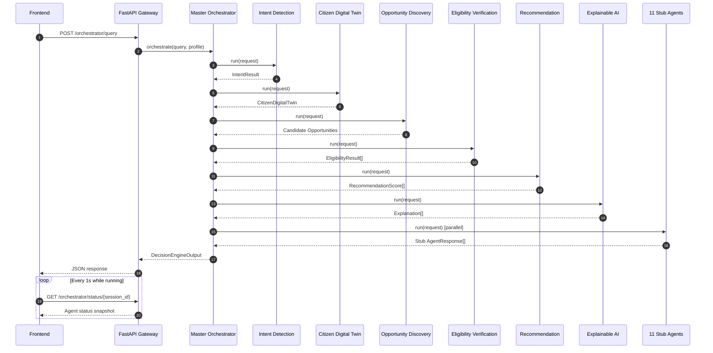

# Agent Sequence Diagram

Full orchestration sequence for a single citizen query, from frontend request to aggregated response.

See [`docs/agent-workflow.md`](../../docs/agent-workflow.md) for the full per-agent specification and [`docs/data-flow.md`](../../docs/data-flow.md) for the narrative walkthrough.
