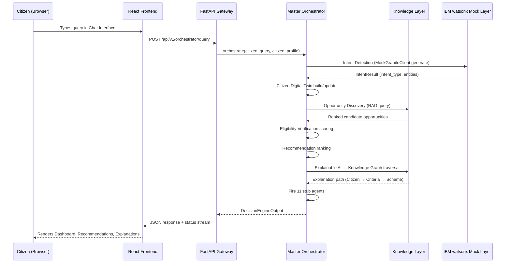

# Data Flow

This document traces a single citizen query end-to-end through IntelliGov AI.

## Step-by-Step Flow

## Data Flow Narrative

1. **Input Processing** — the citizen submits free-text via the Chat Interface or structured input via the profile form. This is sent as an `AgentRequest` (citizen_id, query, context, session_id).
2. **Orchestration Kickoff** — the FastAPI Gateway passes the request to `MasterOrchestrator.orchestrate()`, which generates a `session_id` for status tracking.
3. **Intent Detection** — classifies the query into one of: `SCHEME_DISCOVERY`, `SCHOLARSHIP_SEARCH`, `JOB_SEARCH`, `ELIGIBILITY_CHECK`, `DOCUMENT_HELP`, `CAREER_GUIDANCE`, `GENERAL_QUERY`, and extracts entities (state, age, category).
4. **Citizen Digital Twin** — retrieves the citizen's existing twin from the in-memory twin store, or builds a new one, inferring `life_stage` (student, job-seeker, farmer, etc.).
5. **Opportunity Discovery (RAG)** — the `RAGPipeline` queries the ChromaDB vector store for opportunities semantically relevant to the query, filtered by the detected intent category.
6. **Eligibility Verification** — each candidate opportunity's machine-readable criteria (min/max age, max income, required caste/gender/state, min education) is compared against the citizen profile, producing an `EligibilityResult` with a 0–100 score.
7. **Recommendation** — eligible opportunities are ranked by `eligibility_score × benefit_value × deadline_urgency × citizen_preference`, producing the top 5 `RecommendationScore` results.
8. **Explainable AI** — for each top recommendation, the Knowledge Graph is traversed from the Citizen node through matched `EligibilityCriteria` to the `Scheme` node, generating a human-readable, step-by-step explanation with a confidence score breakdown.
9. **Stub Agent Pass** — the remaining 11 agents run and return structured placeholder contributions (e.g., Opportunity Loss Detector flags any missed deadlines using existing mock data).
10. **Aggregation** — all agent outputs are merged into a single `DecisionEngineOutput`.
11. **Response & Visualization** — the Gateway returns the aggregated output; the frontend polls `/orchestrator/status/{session_id}` throughout to animate the Agent Pipeline Visualizer in real time.

## Data Persistence Notes

- **Citizen profiles & Digital Twins** — in-memory store for the demo build (documented as a Redis/Db2 replacement point for production).
- **Opportunities data** — static JSON files ingested into ChromaDB at startup; no live writes during a session.
- **Session/status state** — in-memory dictionary, keyed by UUID4 `session_id`.
